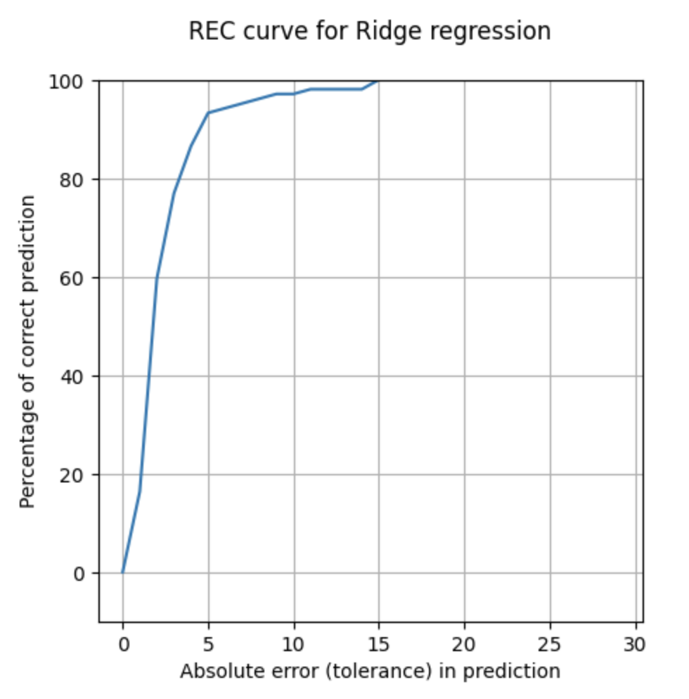

## Supervised Regression: Predicting Alcohol Consumption and Liver Disorders

This report presents a supervised regression approach to predict alcohol consumption that may lead to liver disorders using a dataset provided by BUPA Medical Research Ltd. This dataset contains blood test results and the number of alcoholic beverages consumed per day.
***

## Introduction 

Excessive alcohol consumption is a leading cause of liver disorders. Machine learning models can assist healthcare professionals in identifying patients who may benefit from alcohol-related interventions and reduce the burden of liver disorders. This project utilizes supervised regression to predict a continuous target variable (in this case, alcohol consumption) based on input features (blood test results).

## Data

The machine learning approach used in this study involves several steps, including data preprocessing, model selection, training, evaluation, and comparison. The primary steps are explained below:

# Data Preprocessing

Log Transformation: The target variable, "drinks," representing the number of alcoholic beverages consumed, is log-transformed to mitigate the impact of outliers and achieve a more normal distribution of the target variable.

{: width="100" }
*before preprocessing*

{: width="100" }
*after preprocessing*

Data Splitting: The dataset is split into training and testing sets, with 70% of the data used for training and 30% for testing.

## Modelling

# Model Selection and Training

Three regression models are selected and trained on the training data:

Linear Regression: A linear regression model with Ridge regularization is used to predict alcohol consumption.
{: width="100" }

Support Vector Regression (SVR): SVR with a linear kernel is employed as a non-linear regression model.

Decision Tree Regressor: A decision tree regressor is utilized as a non-linear regression model.

{: width="100" }

Multi-layer Perceptron (MLP) Regressor: An MLP regressor with two hidden layers is applied.
{: width="100" }

For model evaluation, the following metrics are used:

Root Mean Squared Error (RMSE): To measure the accuracy of predictions.
Relative Error Curve (REC): To assess the percentage of correct predictions within a specified tolerance level.

## Results

I started off with linear regression, whose REC curve (see above) shows a more gradual increase and reaches 100% correct predictions at a higher tolerance level compared to the MLP Regressor, which suggests it may not perform as well at lower tolerance levels. As on the REC curves above, the curve for the SVR model is slightly above the curve for the Decision Tree model, which suggests that the SVR model has a marginally better accuracy for smaller tolerances. The MLP Regressor plot, however, shows that the REC curve quickly reaches close to 100% of correct predictions at a lower tolerance compared to the Ridge Regression model, suggesting that it has a good fit to the training data.

Before determining the MLP plot as the perfect plot, see the RMSEs below:

RMSE for MLPRegressor: 0.4058990277661763
RMSE for SVR: 0.31478938771565534
RMSE for Decision Tree Regressor: 0.40938054133445984
RMSE for linear regression: 0.3025195408360982

The linear regression model with Ridge regularization has the lowest RMSE of 0.3025, making it the best performing model in terms of RMSE among the ones listed. This indicates that, on average, the predictions made by the Linear Regression model are closer to the actual values than those made by the other models.

## Conclusion

It's interesting to note that the REC curves suggested the MLP Regressor might be the best model due to its rapid approach to a high percentage of correct predictions within a smaller tolerance. However, the RMSE values indicate that the Linear Regression model is actually the most accurate in predicting the target variable.

RMSE is directly related to the accuracy of predictions, while REC curves provide insights into how well the model performs across different tolerance levels for errors. Therefore, if we prioritize RMSE as the performance metric, the Linear Regression model with Ridge regularization would be considered the best model for this specific task.

## References
Liver Disorders. (1990). UCI Machine Learning Repository. https://doi.org/10.24432/C54G67.

[back](./)

