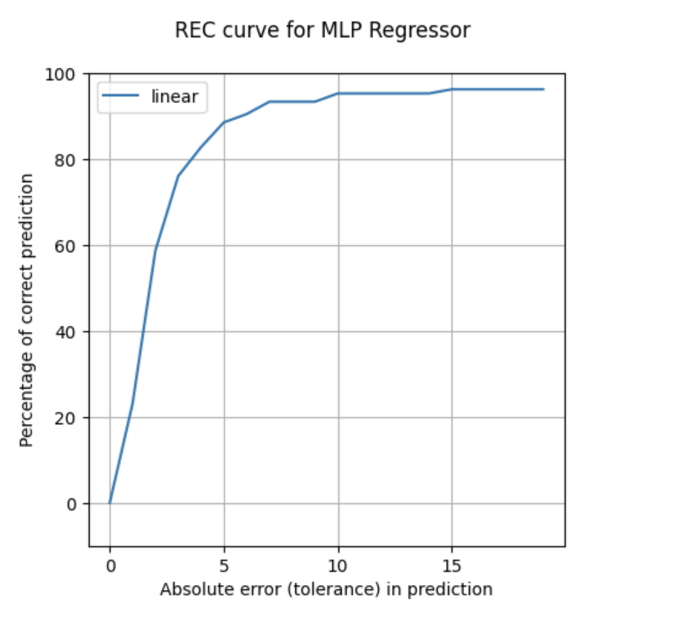

## Supervised Regression: Predicting Alcohol Consumption and Liver Disorders

This report presents a supervised regression approach to predict alcohol consumption that may lead to liver disorders using a dataset provided by BUPA Medical Research Ltd. This dataset contains blood test results and the number of alcoholic beverages consumed per day.
***

## Introduction 

Excessive alcohol consumption is a leading cause of liver disorders. Machine learning models can assist healthcare professionals in identifying patients who may benefit from alcohol-related interventions and reduce the burden of liver disorders.

We did this to solve the problem. We concluded that...

## Data

The machine learning approach used in this study involves several steps, including data preprocessing, model selection, training, evaluation, and comparison. The primary steps are explained below:

# Data Preprocessing

Log Transformation: The target variable, "drinks," representing the number of alcoholic beverages consumed, is log-transformed to mitigate the impact of outliers and achieve a more normal distribution of the target variable.

{: width="200" }
*before preprocessing*

{: width="200" }
*after preprocessing*

Data Splitting: The dataset is split into training and testing sets, with 70% of the data used for training and 30% for testing.

# Model Selection and Training

Three regression models are selected and trained on the training data:

Linear Regression: A linear regression model with Ridge regularization is used to predict alcohol consumption.
{: width="200" }

Support Vector Regression (SVR): SVR with a linear kernel is employed as a non-linear regression model.

Decision Tree Regressor: A decision tree regressor is utilized as a non-linear regression model.

{: width="200" }

Multi-layer Perceptron (MLP) Regressor: An MLP regressor with two hidden layers is applied.
{: width="200" }


## Modelling

Here are some more details about the machine learning approach, and why this was deemed appropriate for the dataset. 

The model might involve optimizing some quantity. You can include snippets of code if it is helpful to explain things.

```python
from sklearn.ensemble import ExtraTreesClassifier
from sklearn.datasets import make_classification
X, y = make_classification(n_features=4, random_state=0)
clf = ExtraTreesClassifier(n_estimators=100, random_state=0)
clf.fit(X, y)
clf.predict([[0, 0, 0, 0]])
```

This is how the method was developed.

## Results

Figure X shows... [description of Figure X].

## Discussion

From Figure X, one can see that... [interpretation of Figure X].

## Conclusion

Here is a brief summary. From this work, the following conclusions can be made:
* first conclusion
* second conclusion

Here is how this work could be developed further in a future project.

## References
[1] DALL-E 3

[back](./)

